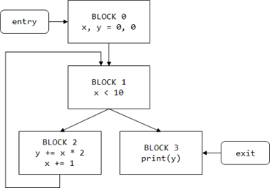

# python-analysis

A Typescript library for parsing Python 3 and doing basic program analysis, 
like forming control-flow graphs and def-use chains.

## Parsing

To parse Python 3 code, pass a string containing the code to the `parse` method.

```
const code = [
    'x, y = 0, 0',
    'while x < 10:',
    '   y += x * 2',
    '   x += 1',
    'print(y)'
];
const tree = parse(code.join('\n')); 
```
This method returns a tree of `SyntaxNode` objects, discriminated with a `type` field. 
The library also provides a function `walk` for pre-order tree traversal. With no arguments, it returns 
a list of the syntax nodes in the tree.  

```
walk(tree).map(node => node.type)
// produces ["module", "assign", "literal", "literal", "name", "name", "while", "binop", …]
```

Optionally, `walk` takes a visitor object with methods `onEnterNode` (for pre-order traversal) and `onExitNode` (for post-order traversal).

Syntax nodes can be turned back into code with the `printNode` function, which produces a string. There is no guarantee of round-tripping. That is `printNode(parse(`_code_`))` could be syntactically different than _code_, but will be semantically the same. For example, there may be extra parentheses around expressions, when compared with the original code. The `printNode` function is primarily for debugging.

## Control flow

A control flow graph organizes a parse tree into a graph where the nodes are "basic blocks" (sequences of statements that run together) and the edges reflect  the order of block execution.

```
const cfg = new ControlFlowGraph(tree);
```

`cfg.blocks` is an array of the blocks in the control flow graph, with `cfg.entry` pointing to the entry block and `cfg.exit` pointing to the exit block.
The control flow graph for the parse tree above looks like this.




 Each block has a list of its statements.
```
printNode(cfg.blocks[0].statements[0])
```
prints `x, y = 0, 0`.

The methods `cfg.getSuccessors` and `cfg.getPredecessors` allow the edges to be followed forward or backward.
```
const cond = cfg.getSuccessors(cfg.entry)[0];
printNode(cond)
```
prints `x < 10`.

## Data flow

The library also provides basic def-use program analysis, namely, tracking where the values assigned to variables are read. For example, the 0 assigned to `x` in the entry block is read in the conditional `x < 10`, in the assignments `y = x * 2` and `x += 1`. 

```
const analyzer = new DataflowAnalyzer();
const flows = analyzer.analyze(cfg).flows;
for (let flow of flows.items) 
    console.log(printNode(flow.fromNode) + 
        " -----> " + printNode(flow.toNode))
```
prints
```
x, y = 0, 0 -----> x < 10
x, y = 0, 0 -----> print(y)
x, y = 0, 0 -----> y = x * 2
x += 1 -----> x < 10
y = x * 2 -----> print(y)
x += 1 -----> y = x * 2
```
